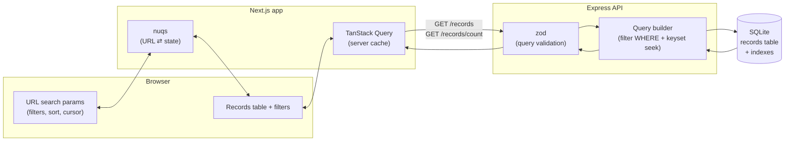
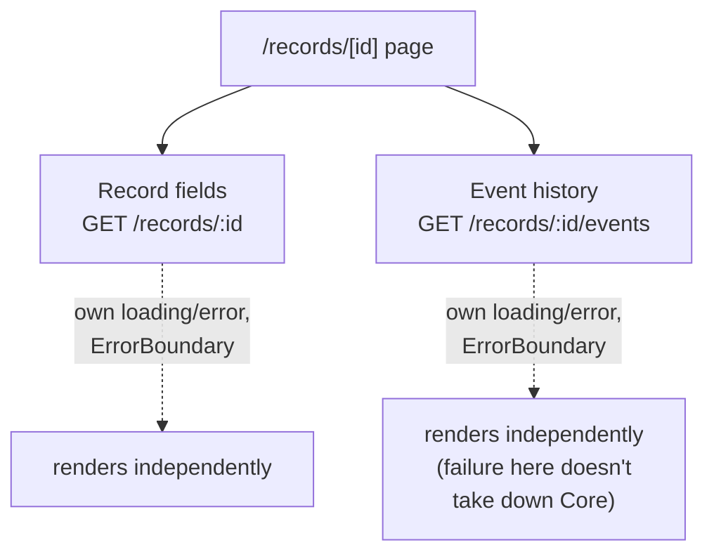

# Architecture

## Scope of this document

The challenge splits the deliverable on purpose: build a small real slice
(pagination + filters against the API), design the rest. This document
covers both — sections are marked **(built)** or **(designed, not built)**
so it's clear what's backed by working code today versus what's the plan
for getting there.

## Data flow



The URL is the single source of truth for filters, sort, and pagination
position — not React state. `nuqs` keeps it in sync with the UI; reloading
the URL reproduces the exact same view.

## API design (built)

### Pagination: keyset, not offset

`GET /records` originally streamed the entire table with no pagination at
all. Redesigning it, the first real choice was offset (`page`/`pageSize`)
vs. keyset/cursor pagination.

Offset's apparent advantage — a shareable page number — doesn't actually
hold up: an opaque cursor in a URL query param is just as shareable and
reloadable as `page=5`. What's real is the cost profile:

- **Offset is O(offset) per request.** SQLite has to walk past the skipped
  rows before it can return the page, even with a supporting index. The API
  runs on `better-sqlite3`, which is **synchronous** — that walk blocks
  Node's event loop for the whole process, stalling every concurrent
  request, not just the slow one.
- **Offset drifts under concurrent writes.** The table "sigue creciendo"
  per the brief. If rows are inserted while an operator pages through
  results, offset pagination can skip or duplicate rows across page
  boundaries — a correctness bug, not just a performance one.
- **Keyset seeks via the index in O(log n)** regardless of depth, and is
  stable under inserts because it anchors to actual row values
  (`created_at`, `id`), not a position.

The trade-off accepted: keyset can't jump to an arbitrary page number, only
step forward/backward from a known position. Judged acceptable — an ops
table with combinable filters doesn't need arbitrary-depth jumps; if an
operator needs "record #40,000", they filter down to it instead.

### URL scheme: `cursor` + `edge`

`GET /records` accepts `cursor` (opaque, base64 of `{ sortValue, id }`) and
`edge` (`after` | `before`), following the standard Relay-style connection
pagination pattern:

- No `cursor` → first page.
- `edge=after` → seek forward from `cursor` (Next uses the current page's
  `pageInfo.endCursor`).
- `edge=before` → seek backward from `cursor`, then reverse the result
  before returning, so rows are always in the requested `sort` order (Prev
  uses the current page's `pageInfo.startCursor`).

This makes every page **reload-safe without a client-side history stack**:
the URL always stores exactly the `cursor`+`edge` pair that reproduces the
currently-displayed page. Changing any filter or the sort direction resets
back to the first page — a cursor only means something within the
filter+sort "space" it was issued in.

### Filters: combinable, not just one

`status` (equality) and `from`/`to` (inclusive range on `created_at`) are
combinable with AND. `from`/`to` was chosen as the second filter because it
reuses the same index the default sort needs — nearly free once that index
exists — and it exercises a real multi-condition query instead of just
describing "combinable" in prose with a single filter.

### Sorting and indexing

`sort=createdAt:asc|desc` is the only sortable column for now (default
`desc`). Two indexes support it:

- `(status, created_at, id)` — serves `status` alone or `status` + date
  range together, seekable by `created_at`.
- `(created_at, id)` — serves the date-range-only and unfiltered cases.

Both are declared plain-ascending. SQLite scans a B-tree index in either
direction, so one index serves both `asc` and `desc` — no need for
separate ascending/descending indexes. `id` is the tiebreaker column in
both, since `created_at` alone isn't unique.

**(designed, not built):** adding `amount` or `dueDate` as sortable columns
follows the same pattern — one `(column, id)` index each. The real
limitation isn't the index count, it's **filter×sort combinations**: a
filter on one column and a sort on a different, uncovered column can't both
be served by a single index, so SQLite falls back to sorting the filtered
set in memory before applying `LIMIT`. Unlike the offset problem, this cost
scales with filter *selectivity*, not pagination depth — a status filter
narrows ~1M rows to ~170k before the in-memory sort, which is a bounded,
one-time cost per request rather than a repeated per-page walk. The planned
mitigation is adding composite indexes reactively for the filter×sort
combinations real usage actually exercises, not pre-building every
possible pair — that doesn't scale on a table that keeps growing (every
extra index has a write-amplification cost on every insert).

### Count is a separate endpoint

`GET /records/count` takes the same filter params (no pagination/sort) and
returns `{ total }` on its own, instead of being embedded in every
`/records` response. Reasoning:

- **Different cost profile.** `COUNT(*)` over a filter and `LIMIT`-ing a
  page have different costs, and the count doesn't change across Prev/Next
  — bundling it means recomputing it on every page click for no reason.
- **Different cache lifetime.** The frontend can cache the count keyed only
  by filters, separate from the page cache keyed by filters+cursor+sort —
  paging doesn't invalidate it, changing a filter does.
- **Independent loading/failure.** The table can render as soon as rows
  arrive without waiting on the count, and a slow/failed count doesn't take
  the table down with it — the same partial-failure-isolation principle the
  brief asks for elsewhere (the detail view's independently-loaded
  sections), applied to the list too.
- **Accepted trade-off:** the two are no longer computed atomically, so
  under heavy concurrent writes they could reflect slightly different
  moments. Acceptable for an ops tool, not for a financial ledger.

## Frontend architecture (built)

### Feature-sliced, not route-sliced

```
src/
  app/            # Next.js routing + the two providers below
  features/
    records/      # everything the records panel needs: api client,
                   # URL-state hook, query hooks, UI components
```

The panel lives directly at `/` for now, since it's the only feature. As
more entities show up (customers, invoices, …) each gets its own
`features/<entity>/` slice and its own route (`/customers`, …) — `app/`
stays thin (routing + layout + providers), the feature folders hold the
actual logic. This is the same shape scaled up, not a restructure.

### TanStack Query + nuqs, not more

The stack for this slice is deliberately narrow:

- **TanStack Query** owns server state (`useRecordsQuery`,
  `useRecordsCountQuery`) — caching, `placeholderData: keepPreviousData`
  so Prev/Next doesn't flash a loading state, and independent
  loading/error per query (see the count-endpoint rationale above).
- **nuqs** owns URL state (`useRecordsFilters`) — the concrete
  implementation of the `cursor`/`edge`/filter/`sort` URL scheme described
  above. React component state is used for neither of these; both are
  either server-cache or URL, matching "todo el estado de la vista vive en
  la URL."
- **No TanStack Table, no Radix/shadcn, no virtualization** in this pass.
  A native `<table>`, `<select>`, and two `<input type=date>` are enough
  for one sortable column, two filters, and Prev/Next. Each gets adopted
  when something actually needs it, not ahead of time:
  - **TanStack Table** once there are enough columns/sort states/row
    selection to justify headless table logic over a mapped array.
  - **Radix/shadcn** once an interaction needs real primitives — a
    multi-select combobox for status, a bulk-action confirmation dialog,
    toasts for background errors. A single native `<select>` doesn't need
    a UI kit.
  - **TanStack Virtual** once a single view needs to render far more rows
    than fit on screen at once — doesn't apply here because pages are
    small (≤100 rows) by design; it solves a rendering problem this slice
    doesn't have.

## Testing (built)

Vitest on both sides, with separate configs — `api/` is its own npm
project, and the frontend's config carries React/DOM settings that don't
belong in a Node test run.

**The API is tested against a real seeded SQLite database, not mocks.** The
suite spawns `seed.ts` with `RECORDS=500` into a temp DB before importing
the app. Mocking the database here would test nothing worth testing: the
logic most likely to be wrong is the keyset seek predicate and how the
filter `WHERE` composes with it, and that only misbehaves against a real
query planner. The highest-value case is the **cursor round-trip** — page
forward with `endCursor`, then back with `startCursor`, and assert you land
on the exact same rows. Keyset pagination's characteristic bug is an
off-by-one at the page boundary that silently skips or repeats a row, and
that assertion is what catches it. A second case pages through an entire
filtered result set and asserts the row count matches `/records/count`,
which covers both endpoints agreeing.

**On the frontend, the tests target invariants, not markup.** For
`useRecordsFilters`: that changing a filter clears `cursor`/`edge`, and
that `clearFilters` resets filters and pagination while preserving
`sortDir`. Those are the rules that make URL state coherent, and they're
easy to break later without noticing. For `RecordsTable`: the
loading/empty/error states resolve as expected against a mocked
`fetchRecords`. For the composer: that context reaches parts at different
depths and that misuse throws — the contract, not the stubs.

**Deliberately not tested:** exact markup, styling, and the composer's stub
bodies. Asserting on those buys regression noise, not confidence.

### The gap worth naming

Nothing verifies that the frontend and the API still agree on the contract.
The DTO types in `src/features/records/api.ts` are hand-written, and we
chose not to re-validate responses with zod on the client (we own both
ends, so it seemed like redundant runtime work). The cost of that choice is
precisely this: if the API's response shape changed, the frontend would
compile fine and break at runtime, and no test would catch it.

Three ways to close it, in increasing order of cost: generate the client
types from the server's zod schemas so there is one source of truth; add a
contract test that asserts a real API response parses into the expected
shape; or add an end-to-end test (Playwright) covering the flow the unit
tests can't — load a filtered URL, page forward, reload, and confirm the
same rows come back. The E2E is the one I'd write first, because
reload-safety is the central promise of the URL-state design and it's
currently only verified by hand.

## Full panel design (designed, not built)

Everything below is design for the rest of the brief — reasoned through,
not built in this pass.

### The two remaining filters

- **Amount range.** Mechanically the same as the date-range filter — a
  `(amount, id)` index, same `from`/`to`-style params. The real question
  isn't mechanical, it's semantic: `amount` is stored per-record in that
  currency's minor unit, and the table mixes six currencies. A raw
  `amount >= 10000` filter would silently compare CLP pesos to USD cents,
  which is meaningless. Two honest options: (a) scope the amount filter to
  require a `status`-style single currency selection alongside it, so the
  comparison is always apples-to-apples, or (b) normalize to a reporting
  currency via exchange rates — real complexity (rates change over time,
  which rate applies to a historical record?) that I wouldn't take on
  without a product decision first. I'd ship (a) and flag (b) as a real
  follow-up, not fake precision by silently comparing raw integers.
- **Text search (`name`).** At 1M+ rows, `LIKE '%...%'` is a full table
  scan with no index able to help — this needs SQLite FTS5: a virtual
  table indexing `name`, kept in sync with `records` via `INSERT`/`UPDATE`
  triggers (or rebuilt alongside the seed script, same idea as the current
  indexes). Combined with existing filters, the query becomes a join
  between the FTS5 match and the base table's filtered/sorted set — the
  FTS5 side handles the text match efficiently, the existing indexes still
  handle `status`/date-range/sort on the joined rows. FTS5 also gives a
  natural `bm25()` relevance score, which is a fine default sort *when a
  search term is active*, distinct from the `createdAt` default otherwise.

### Bulk selection

The brief's specific ask — "select the N records matching the current
filter, not just the visible page" — needs a selection model that isn't
just a list of IDs, because that list could be hundreds of thousands of
entries long.

**Model:** selection is either
- `{ mode: 'include', ids: string[] }` — a handful of explicitly-picked
  rows (the common case: check a few boxes across a page or two), or
- `{ mode: 'exclude', filter: RecordsFilters, excludedIds: string[] }` —
  "everything matching the current filter, except these few I unchecked"
  (the Gmail "select all 42,318 that match" pattern, entered via a banner
  that appears once you check every box on the visible page and there's
  more beyond it).

**Where it lives:** *not* the URL. Filters/sort/page are "what am I
looking at" — shareable, meant to survive a reload. Selection is "what am
I about to act on" — ephemeral, scoped to this session, and arguably
*should* be dropped on reload rather than silently persisted (nobody
wants a stale bulk-destructive selection to survive a refresh unnoticed).
It lives in local component/store state instead.

**The bulk action itself:** a single endpoint (e.g.
`POST /records/bulk-action`) accepting either shape from the model above,
reusing `buildFilterWhere` for the `exclude` case (plus an
`id NOT IN (...)` clause for the excluded IDs). The part worth calling
out: `better-sqlite3` is synchronous, so an unbounded bulk update over
hundreds of thousands of rows would block the whole server for the
duration — the exact risk we already designed around for deep pagination.
Same mitigation shape: cap synchronous bulk actions to a safe size (a few
thousand rows), and route anything larger through an async job
(`202 Accepted` + a job id the client polls) instead of blocking the
request. Any destructive/state-changing bulk action also needs a
confirmation step showing the exact count first — the same "operator
needs to know how many records match" principle that drove
`/records/count` as its own endpoint.

### Detail view

Route: `/records/[id]`. Two independent data sources, matching the
brief's "loaded independently, doesn't block the rest of the layout"
requirement — and the same principle we already applied to
`/records/count` vs. `/records`, one level deeper:



`GET /records/:id` (the record's own fields) and `GET /records/:id/events`
(its event history — no `events` table exists yet, so this is modeled as
a future resource, not built) are separate queries with separate
loading/error states, same pattern as `useRecordsQuery` /
`useRecordsCountQuery`. One addition beyond what the list needed: each
section gets wrapped in a real React `ErrorBoundary`, not just a
TanStack Query `isError` check. `isError` handles a *failed fetch*
gracefully (which is most of what "a section breaks" means here), but a
genuine render-time exception in one section's component is a different
failure mode that only an actual error boundary catches — without one, a
bug in the events section could still crash the whole page even though
its data fetching "succeeded." Both matter for real partial-failure
isolation.

Navigating from a row to `/records/[id]` via `<Link>` (not a full
navigation) keeps the list's filter/sort/page state in browser history for
free — "back" returns to the exact list view the operator left, no extra
work needed beyond what the URL-state design already gives us.

### Observability

The brief is explicit: this is a business tool, and breakage needs to be
*noticed*, not just silently logged somewhere no one reads. Concretely:

The distinction that matters for sequencing isn't cheap vs. expensive —
it's **what actually notifies a person** vs. what only helps you
investigate afterwards. Structured logs and timing data are the second
kind: they sit in stdout waiting to be read. Shipping only those would
mean nobody finds out about anything, which is exactly what the brief
warns against.

**Things that tell a human something is wrong:**

- An external uptime check against a `GET /health` endpoint, emailing or
  posting to Slack when it fails. Beyond the endpoint itself this is no
  code at all, and it covers the one failure no internal logging can
  report — the API being down, because the process that would do the
  reporting is the one that died.
- Error tracking (e.g. Sentry) on both sides, frontend and backend. The
  code is a DSN and an init call; most trackers notify on a
  newly-seen error type out of the box, which is already enough for
  someone to find out.
- **Reporting from the error states we already built.** `RecordsTable`
  and `Pagination` have `isError` branches today, and they're dead ends:
  the operator sees "Count unavailable" and nobody else ever learns of
  it. Wiring those exact points to the tracker costs almost nothing and
  catches the realistic failure — a failing API call, not a JavaScript
  crash. An operator shrugging at a broken panel is precisely the
  scenario to design against.

**Things that only help once you're already looking:**

- Structured logging in the API (e.g. `pino`) with request IDs, so a
  failed request can be traced end-to-end.
- Query-timing instrumentation: log each query's duration alongside the
  filter+sort combination that produced it. This is what turns "add
  composite indexes reactively" from a nice sentence into something
  actionable — without it there's no record of which combinations
  operators actually hit, or which ones are slow.

**And the part that's a decision, not a feature:** alert thresholds that
don't generate noise, domain-specific signatures worth paging on (failed
bulk actions, DB errors), and who they route to. Tuning this before there
is real traffic to tune against is guesswork, which is why it lands after
the tooling rather than with it.

### Locale, made dynamic

Amount formatting already handles the real multi-currency requirement
correctly (per-record currency, correct minor-unit divisor). What's
hardcoded is the *display* locale (`es-AR`) — number grouping, date
format. The real version derives it from a user/org setting (persisted
server-side) or the `Accept-Language` header on first load, rather than a
constant.

### Development plan

**Already built:** pagination (keyset), two combinable filters
(status + date range), one sortable column, loading/empty/error states,
a separate count endpoint, a first keyboard-shortcut pass.

Sequenced by dependency and risk rather than by value alone: the point of
the ordering is that nothing which mutates data at scale ships before
there's a way to notice it breaking.

**Iteration 2 — finish the list view.** Everything here reuses patterns
already in place:

1. `amount` / `dueDate` sortable columns — one `(column, id)` index each,
   following the pattern already established for `createdAt`
2. Text search via FTS5 — the only new infrastructure in this iteration
3. The reload-safety E2E and the contract gap from
   [Testing](#testing-built), before this iteration's extra surface area
   makes them more expensive to retrofit
4. **Enough observability that someone finds out when this breaks** — the
   brief treats that as a requirement, not a nicety, so it doesn't wait
   for a later iteration. Specifically: a `GET /health` endpoint with an
   external uptime check pointed at it, an error tracker initialised on
   both sides with its default notifications, and the existing `isError`
   branches in `RecordsTable` / `Pagination` reporting to it instead of
   dead-ending at the operator. Plus the diagnostic half — request-ID
   logging and query-timing instrumentation — which is cheap here and
   starts accumulating the usage data the index strategy below depends
   on, including whether FTS5 actually performs once it lands.

The amount-range filter is designed and ready but blocked on the
cross-currency product decision above; raise it at the start of this
iteration and build it whenever the answer arrives.

**Iteration 3 — detail view, and the rest of the safety net.**

1. Detail view with independently-loaded, error-boundary-isolated
   sections — self-contained, and what satisfies the brief's
   partial-failure requirement
2. Alerting policy on top of iteration 2's tooling: thresholds that don't
   generate noise, domain-specific signatures worth paging on, and who
   they route to. Deliberately after the tooling — tuning thresholds
   before there's real traffic to tune against is guesswork.

**Iteration 4 — bulk selection and one real bulk action.** Deliberately
last among the brief's requirements: it's the only one that mutates data
at scale, so it wants the confirmation UX, the synchronous-size cap, and
iteration 3's alerting already in place. Shipping it earlier would make
the most destructive operation in the panel also the one nobody is told
about when it fails.

**Later:**

1. Dynamic locale
2. Async job queue, once bulk actions outgrow the synchronous-safe cap
3. TanStack Table, Radix/shadcn, and TanStack Virtual — each at the
   trigger described above, not before
4. Composite filter×sort indexes, chosen from the query timings iteration
   2 started collecting rather than guessed at

**Scaling to more entities:** the feature-sliced shape
(`src/features/<entity>/{api,components,hooks}`) repeats per entity —
`customers`, `invoices`, whatever comes next — each with its own route.
Cross-cutting pieces (the query client setup, `Kbd`, an error-boundary
wrapper, the `Intl` formatting helpers) move into a shared `src/lib/` or
`src/components/` layer once a second or third feature actually needs
them — not pre-extracted speculatively now, on the same "build what's
needed" logic used throughout this pass.

### Assumptions & open questions

- **Amount filtering across currencies** needs a product decision (scope
  to one currency vs. normalize via exchange rates) — flagged above, not
  resolved unilaterally.
- **Text search** is assumed to target `name` only, the one free-text
  field; extending it to `id` (exact/prefix match) is a small follow-up if
  operators turn out to search by record ID.
- **Bulk action semantics** (what the action actually *does* — status
  change, export, something else) are left open since the brief doesn't
  name one; the design above is about the selection/execution mechanics,
  which hold regardless of the specific action.
- **Event history** has no backing table in the current schema — assumed
  a future resource, modeled here purely to demonstrate the independent-
  loading/isolation pattern the brief asks for.
- **Bulk selection does not survive a reload** — a deliberate choice
  (ephemeral, session-scoped state), not an oversight.
