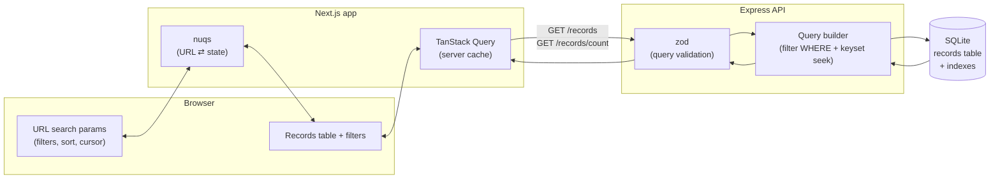

# Architecture

## Scope of this document

The challenge splits the deliverable on purpose: build a small real slice
(pagination + filters against the API), design the rest. This document
covers both — sections are marked **(built)** or **(designed, not built)**
so it's clear what's backed by working code today versus what's the plan
for getting there.

## Data flow

The URL is the single source of truth for filters, sort, and pagination
position — not React state. `nuqs` keeps it in sync with the UI; reloading
the URL reproduces the exact same view.

## API design (built)

### Pagination: keyset, not offset

`GET /records` originally streamed the entire table with no pagination at
all. Redesigning it, the first real choice was offset (`page`/`pageSize`)
vs. keyset/cursor pagination.

Offset's apparent advantage — a shareable page number — doesn't actually
hold up: an opaque cursor in a URL query param is just as shareable and
reloadable as `page=5`. What's real is the cost profile:

- **Offset is O(offset) per request.** SQLite has to walk past the skipped
  rows before it can return the page, even with a supporting index. The API
  runs on `better-sqlite3`, which is **synchronous** — that walk blocks
  Node's event loop for the whole process, stalling every concurrent
  request, not just the slow one.
- **Offset drifts under concurrent writes.** The table "sigue creciendo"
  per the brief. If rows are inserted while an operator pages through
  results, offset pagination can skip or duplicate rows across page
  boundaries — a correctness bug, not just a performance one.
- **Keyset seeks via the index in O(log n)** regardless of depth, and is
  stable under inserts because it anchors to actual row values
  (`created_at`, `id`), not a position.

The trade-off accepted: keyset can't jump to an arbitrary page number, only
step forward/backward from a known position. Judged acceptable — an ops
table with combinable filters doesn't need arbitrary-depth jumps; if an
operator needs "record #40,000", they filter down to it instead.

### URL scheme: `cursor` + `edge`

`GET /records` accepts `cursor` (opaque, base64 of `{ sortValue, id }`) and
`edge` (`after` | `before`), following the standard Relay-style connection
pagination pattern:

- No `cursor` → first page.
- `edge=after` → seek forward from `cursor` (Next uses the current page's
  `pageInfo.endCursor`).
- `edge=before` → seek backward from `cursor`, then reverse the result
  before returning, so rows are always in the requested `sort` order (Prev
  uses the current page's `pageInfo.startCursor`).

This makes every page **reload-safe without a client-side history stack**:
the URL always stores exactly the `cursor`+`edge` pair that reproduces the
currently-displayed page. Changing any filter or the sort direction resets
back to the first page — a cursor only means something within the
filter+sort "space" it was issued in.

### Filters: combinable, not just one

`status` (equality) and `from`/`to` (inclusive range on `created_at`) are
combinable with AND. `from`/`to` was chosen as the second filter because it
reuses the same index the default sort needs — nearly free once that index
exists — and it exercises a real multi-condition query instead of just
describing "combinable" in prose with a single filter.

### Sorting and indexing

`sort=createdAt:asc|desc` is the only sortable column for now (default
`desc`). Two indexes support it:

- `(status, created_at, id)` — serves `status` alone or `status` + date
  range together, seekable by `created_at`.
- `(created_at, id)` — serves the date-range-only and unfiltered cases.

Both are declared plain-ascending. SQLite scans a B-tree index in either
direction, so one index serves both `asc` and `desc` — no need for
separate ascending/descending indexes. `id` is the tiebreaker column in
both, since `created_at` alone isn't unique.

**(designed, not built):** adding `amount` or `dueDate` as sortable columns
follows the same pattern — one `(column, id)` index each. The real
limitation isn't the index count, it's **filter×sort combinations**: a
filter on one column and a sort on a different, uncovered column can't both
be served by a single index, so SQLite falls back to sorting the filtered
set in memory before applying `LIMIT`. Unlike the offset problem, this cost
scales with filter *selectivity*, not pagination depth — a status filter
narrows ~1M rows to ~170k before the in-memory sort, which is a bounded,
one-time cost per request rather than a repeated per-page walk. The planned
mitigation is adding composite indexes reactively for the filter×sort
combinations real usage actually exercises, not pre-building every
possible pair — that doesn't scale on a table that keeps growing (every
extra index has a write-amplification cost on every insert).

### Count is a separate endpoint

`GET /records/count` takes the same filter params (no pagination/sort) and
returns `{ total }` on its own, instead of being embedded in every
`/records` response. Reasoning:

- **Different cost profile.** `COUNT(*)` over a filter and `LIMIT`-ing a
  page have different costs, and the count doesn't change across Prev/Next
  — bundling it means recomputing it on every page click for no reason.
- **Different cache lifetime.** The frontend can cache the count keyed only
  by filters, separate from the page cache keyed by filters+cursor+sort —
  paging doesn't invalidate it, changing a filter does.
- **Independent loading/failure.** The table can render as soon as rows
  arrive without waiting on the count, and a slow/failed count doesn't take
  the table down with it — the same partial-failure-isolation principle the
  brief asks for elsewhere (the detail view's independently-loaded
  sections), applied to the list too.
- **Accepted trade-off:** the two are no longer computed atomically, so
  under heavy concurrent writes they could reflect slightly different
  moments. Acceptable for an ops tool, not for a financial ledger.

## Frontend architecture

_(pending — written once the slice is built)_

## Full panel design

_(pending — bulk selection, detail view, observability, and the
development roadmap, written as a documentation-only pass after the slice
works)_
